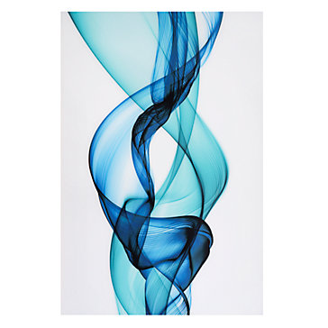

GWSSFluidArch
=============

A multipurpose Android Application Architecture Framework for developing 
Android Applications using App Patterns such as MVP, MVVM, and maybe 
even Flux.

The general idea is to have the app demo as an unstructured TODO-app and 
the other demos(appmvp, appmvvm, appmvc, appredux, and appflux) as structured
demos so that oen can see the pros and cons of each app architecture pattern.

# Articles

# SENIOR ANDROID DEVELOPER NOTE

1. Uncle Bob's Clean Architecture patterns was specifically designed for 
   web applications. AND, most Application Architecture had their definition 
   of origin in either desktop or server environments very different from 
   mobile. Hence, some of the things you will not find in these application 
   architecture pattern libraries is a COMMAND LAYER API, etc as one has 
   to make some smart choices here of what belongs in the Android Application 
   environment.
   
# Developed By

Created by [Fred Grott](http://shareme.github.com).

# Credits

Original concepts and code borrowed from

common: msv Kenny Campagna in MutliStateView project
        router Trikita in router project
        rvexts Ovidiu, Wireless Designs, LLC,
        

custommotto:   Square, it was in their otto project.

flux:     Froelich Stefan a fluxxan project

mvc:      viewmodel is Inloop, s.r.o.

mvp:     viewmodel is Inloop, s.r.o.

mvvm:    viewmodel is Inloop, s.r.o.

redux:   Serge Zaitsev as project jedux

   
# License

Apache 2.0 License